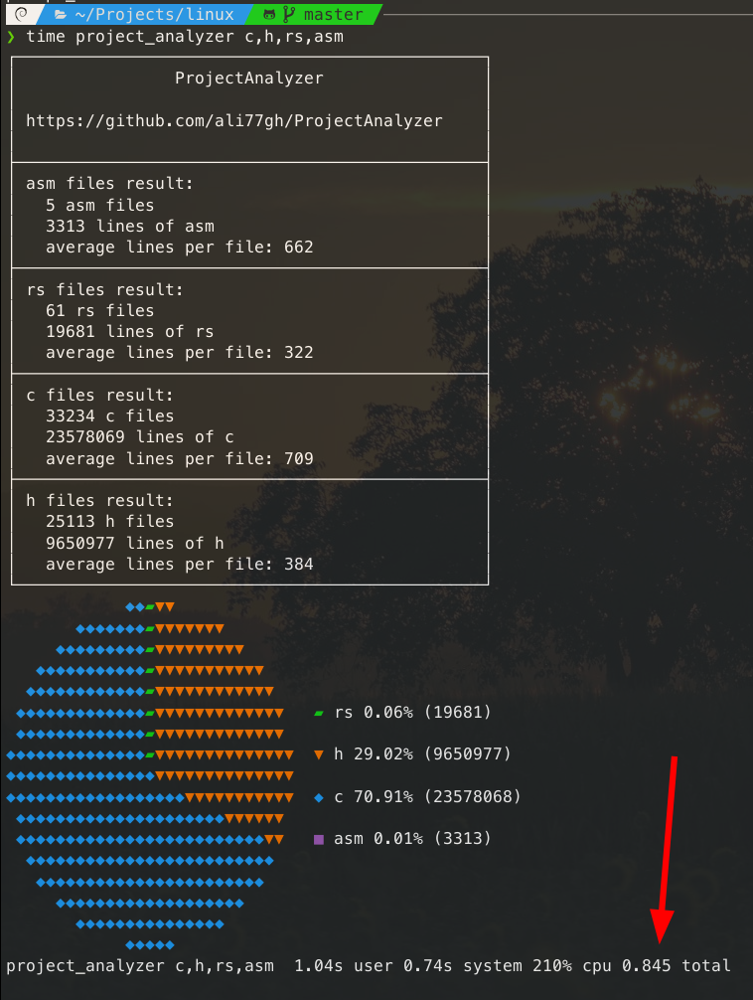

# ProjectAnalyzer

[](https://www.rust-lang.org/) <br>


Fast Rust binary that counts line numbers of a project + a nice pie chart using [piechar](https://github.com/jakobhellermann/piechart).

 <br>

## Performance

Project analyzer can count c, h, rs, asm files of linux kernel in 900ms on my Laptop which is 6-7 times faster than old [python implementation](https://github.com/ali77gh/ProjectAnalyzer/tree/python-impl).

```posh
Thread_1    ➡️    Thread_2    ️️➡️    Thread_3
(filter files)   (read files)      (count newlines)
```

<br>

## How to use

```posh
┌───────────────────────────────────────────────┐
│                ProjectAnalyzer                │
│                                               │
│ https://github.com/ali77gh/ProjectAnalyzer    │
│                                               │
│ How to use:                                   │
│  $ project_analyzer <postfixes>               │
│                                               │
│ Single language Example:                      │
│  $ project_analyzer py                        │
│                                               │
│ Multi language Example:                       │
│  $ project_analyzer py,rs,h,c                 │
│                                               │
│ Options:                                      │
│  -h, --help                                   │
│  -v, --version                                │
│  -u, --update                                 │
│                                               │
└───────────────────────────────────────────────┘
```

<br>

## Installaion

```sh
cd /tmp 
git clone git@github.com:ali77gh/ProjectAnalyzer.git
cd ProjectAnalyzer
cargo build --release

# linux
cp ./target/release/project_analyzer /usr/bin

# MacOS
cp ./target/release/project_analyzer /usr/local/bin/

# Windows
# add binary to Environment Variables Path
```

TODOs:

- [ ] Build:
  - [ ] Build binary for Windows and Mac (maybe with ci/cd).
  - [ ] installation script.

- [ ] Result should sort by user input
- [ ] Fix table problem on huge source codes (calculate spaces)
- [ ] divide Counter module from analyzer (same thing you do with Walker)
- [ ] Refactor project
  - [x] Use tokio for multi-threading
  - [x] Use clap for args parser
  - [ ] Writing some tests (this will force you to do dependency injection)

- [ ] Auto detect source code files
  - [ ] By detecting programming language postfixes

- [ ] Filter empty lines (or bracket only lines)
- [ ] Detect comments and documantation and tests for some programming languages
- [x] Ignore what is in gitignore
- [x] Watch option (live update)
- [x] Ignore directories by --ignore
- [ ] A way to do nested analyze
  - [ ] TUI mode with cd ability
  - [ ] inline small analyze for sub directoriess

- [ ] Json output
- [ ] VS-Code extention
- [ ] Git history for more analyze
- [ ] a website to do all this in frontend by downloading zip from github + WASM (is that even possible? will CORS block me to do this?)
